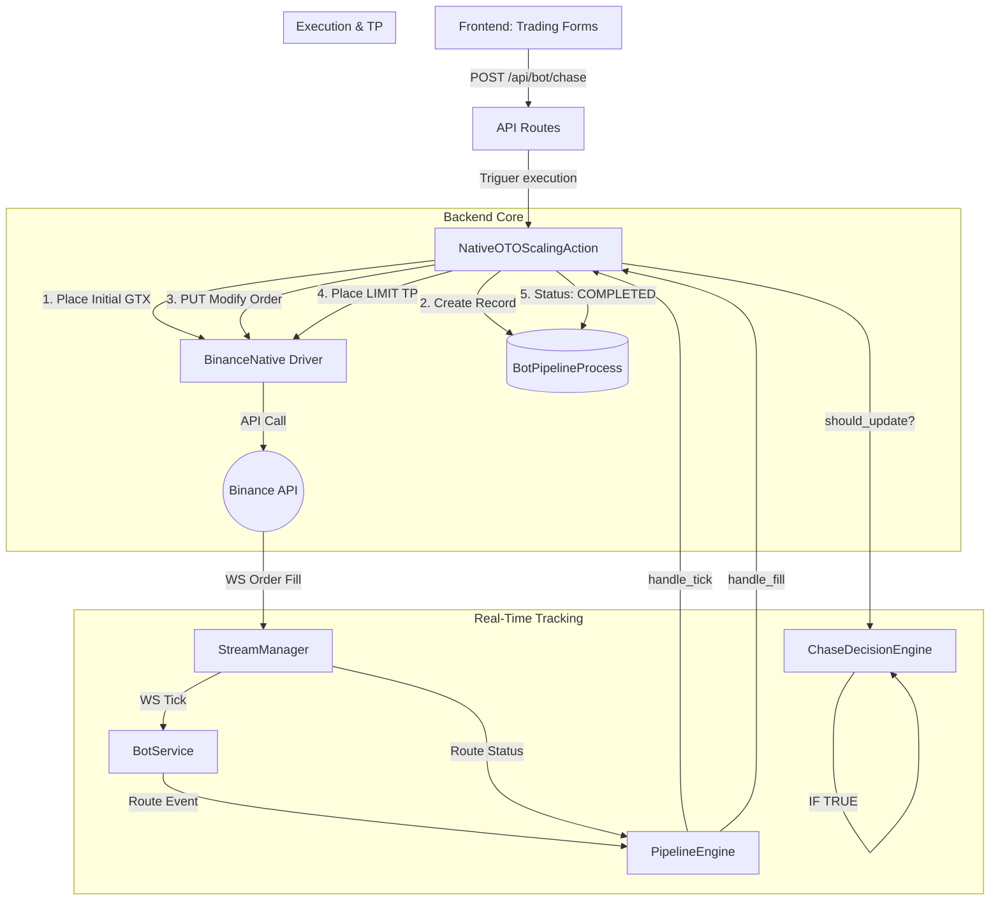

# Mapa Conceptual: Chase Entry (V2)

Este documento detalla la arquitectura y el flujo de trabajo del motor de **Chase Entry**, diseñado para el seguimiento dinámico de precios con órdenes Post-Only en Binance Futures.

## Arquitectura de Módulos

El sistema sigue una arquitectura modular y desacoplada bajo principios SOLID.

## Diccionario de Módulos

### 1. Orquestación y Control
- **`StrategyEngine`** (`backend/app/services/strategy_engine.py`):
    - Actúa como el router principal de eventos en tiempo real.
    - Contiene la lógica de **Polling Fallback** para asegurar consistencia si falla el WebSocket.
- **`BotService`** (`backend/app/services/bot_service.py`):
    - Gestiona el ciclo de vida del proceso de fondo.
    - Conecta el `StreamManager` con el `PipelineEngine`.

### 2. Lógica de Estrategia (Chase V2)
- **`NativeOTOScalingAction`** (`backend/app/services/pipeline_engine/native_actions.py`):
    - Implementación concreta de la estrategia Chase Nativa.
    - **Responsabilidad:** Gestionar la secuencia Ejecutar -> Tick -> Fill -> TP.
- **`ChaseDecisionEngine`** (`backend/app/services/pipeline_engine/chase_manager.py`):
    - El "cerebro" de la decisión.
    - **Criterios:** Umbral de precio (0.05% por defecto), cooldown de tiempo (5s) y lógica direccional (no perseguir en contra de la tendencia inmediata).

### 3. Drivers y Datos
- **`BinanceNative`** (`backend/app/core/binance_native.py`):
    - Driver de bajo nivel para operaciones de alta frecuencia.
    - Utiliza `PUT /fapi/v1/order` para modificar órdenes existentes sin cancelarlas (mantiene prioridad en el libro).
- **`StreamManager`** (`backend/app/core/stream_service.py`):
    - Gestiona las suscripciones WebSocket para precios (Ticker) y eventos de usuario (Orders).

### 4. Persistencia
- **`BotPipelineProcess`** (`backend/app/db/database.py`):
    - Modelo de datos que guarda el estado (`CHASING`, `COMPLETED`, `ABORTED`), el ID de orden activa y el último precio de tick.

---

## Flujo de Datos Crítico

1.  **Activación:** El usuario dispara la acción desde el Dashboard.
2.  **Colocación:** Se coloca una orden `GTX` (Post-Only) al precio actual del libro (Ask/Bid).
3.  **Seguimiento:** Cada tick de precio entrante es evaluado. Si el precio "escapa", la orden se modifica mediante un `PUT` nativo.
4.  **Cierre:** Al llenarse la entrada, el sistema detecta el evento `FILLED` y coloca automáticamente una orden de salida (Take Profit) al porcentaje configurado.
